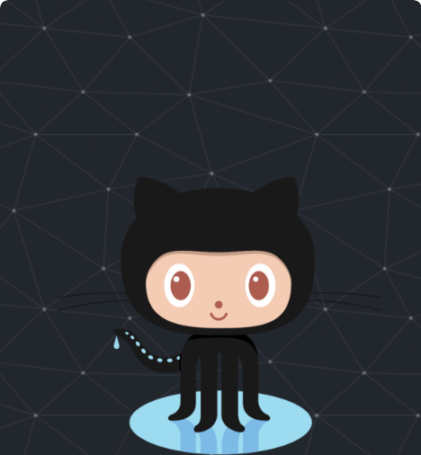

- 📫 How to reach me **sunny64n@gmail.com**

<h3 align="left">Connect with me:</h3>

 
<!--   -->

<h3 align="left">Languages and Tools:</h3>

                  
 

# 📊GitHub Stats :
 

 
 
 

<!--  -->
   
<!--   -->

### ✍️Random Dev Quote

### Badges

<!--

## 🌐 Socials:
     

# 💻 Tech Stack:
                	   

### ✍️ Random Dev Quote

---

-->

<!-- Proudly created with GPRM ( https://gprm.itsvg.in ) -->
